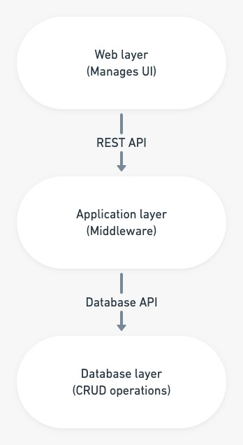

# Template to implement Disaster Recovery Solution for Virtual Network

Web-API-Database is a 3 tier architecture which decouples to presentation, business or application and database layers induvidually. The business layer exposes its API to applications as well as for the remote presentation layer. Remote presentation layer uses REST API. There is a internal database API for communications between application layer and database layer. REST API’s input is processed by the application layer to perform CRUD operations on the database.
<br />

<p align="center">

<br />
    <b> Figure 1.1: Three Tier Architecture </b>  
</p>

<br /><br />
This template creates a Virtual Network with 3 subnets (Webserver, API, Database). Further, Network Security Group are created for each and Inbound, Outbound rules are added to their respective NSG.
For default values , you may refer to [`Parameter.json`](https://github.com/riyaagrahari/ARM-Templates/blob/master/VNet_Template_MultipleSubnet/Parameter.json) file.

Below is the Architectural Diagram for the primary VNets and subnets which are created and network security rules are applied to subnets using NSG.

    

<br />
<p align="center">
    <b> Figure 1.2: Detailed Architectural Diagram for Primary VNet.</b>
</p>
Replica of the primary vnet with its subnets and NSGs are created at some secondary location which comes up as recovery solution in case of a disaster. Communication between these Vnets is established using global peering.

In case of disaster, rules of NSG are appended opening custom ports on both Vnet, allowing database synchronization from secondary to primary region.<br />
Below is the architectural diagram for disaster recovery solution developed where a replica secondary vnet is created and peering is established between them

<p align="center">

<br />
    <b> Figure 1.3: Azure Architectural Diagram for Disaster Recovery Solution- Primary and Secondary Vnet. </b>
</p>
<br /><br />

# Installation

## Three ways of execution:

### 1. Azure Portal 
<br />
<a href="https://portal.azure.com/#create/Microsoft.Template/uri/https%3A%2F%2Fraw.githubusercontent.com%2Friyaagrahari%2FARM-Templates%2Fmaster%2FNestedTemplate_for_DisasterRecovery%2FMaster.json" target="_blank">
    
</a>
<a href="http://armviz.io/#/?load=https%3A%2F%2Fraw.githubusercontent.com%2Friyaagrahari%2FAzure-Templates%2Fmaster%2FNestedTemplate_for_DisasterRecovery%2FMaster.json" target="_blank">
    
</a>
<br />

- Click on Deploy to Azure button for deploying the template directly to Azure Portal.Fill in the required parameters you want for deploying your template.<br/>
- Click on Visualize button for viewing the template and design in armviz.io.<br />

### 2. Azure CLI 
<br />
<a href="https://shell.azure.com" target="_blank">
 
</a>
<br />

- Click on the Launch Cloud Shell button,login with Azure credentials and select Bash shell there to open Azure CLI.
- Upload template file using upload option on Azure CLI portal.<br />
- Use following Azure CLI command to execute template.

```bash
az group deployment create --resource-group <Resource Group Name> --template-file template.json
```

### 3. Azure Powershell Commands
<br />
<a href="https://shell.azure.com" target="_blank">
 
</a>
<br />

- Click on the Launch Cloud Shell button, login with Azure credentials and you will be redirected to powershell portal.
- Upload template file using upload option, change current directory to home directory of azure user as it is default folder for storing  uploaded files(use cd).<br />
- Use following Azure Powershell Command to execute template.

```bash
New-AzResourceGroupDeployment -ResourceGroupName <Resource Group Name> -TemplateFile template.json
```
### 4. Terraform:
<br />
<a href="https://shell.azure.com" target="_blank">
 
</a>
</br>

Terraform can be used for deploying ARM templates. 
- Use [`Master.tf`](https://github.com/riyaagrahari/ARM-Templates/blob/master/NestedTemplate_for_DisasterRecovery/Master.tf) to deploy resources on Azure using terraform.At the end of this file, there is a parameter section, you can change the values to your desired parameter values. 
- Upload [`Master.json`](https://github.com/riyaagrahari/ARM-Templates/blob/master/NestedTemplate_for_DisasterRecovery/Master.json) ARM template so that Terraform can perform operation using it. 
- Configure Terraform [`configuring Terraform`](https://docs.microsoft.com/en-us/azure/virtual-machines/linux/terraform-install-configure) if you are using Azure CLI on your local machine.
- Deploy your template using following commands:

    - ```terraform init ```
    - ```terraform plan ``` 
    - ```terraform apply```
